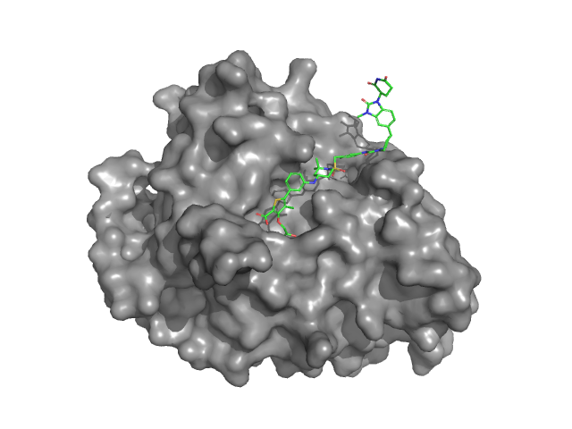
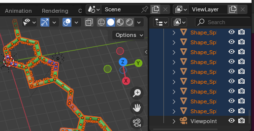
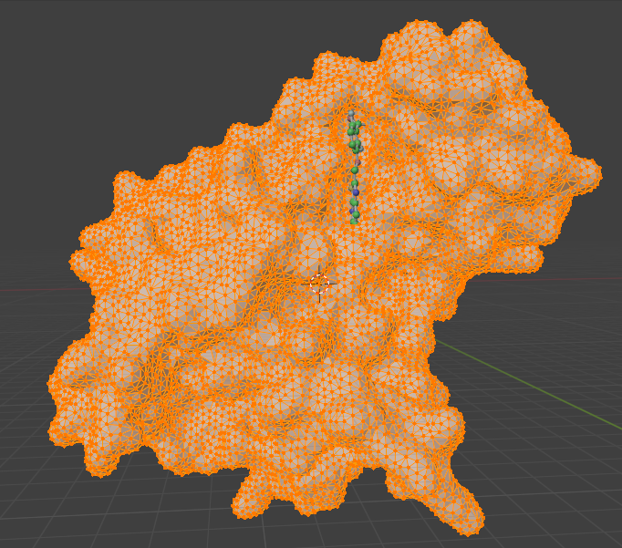
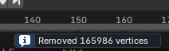
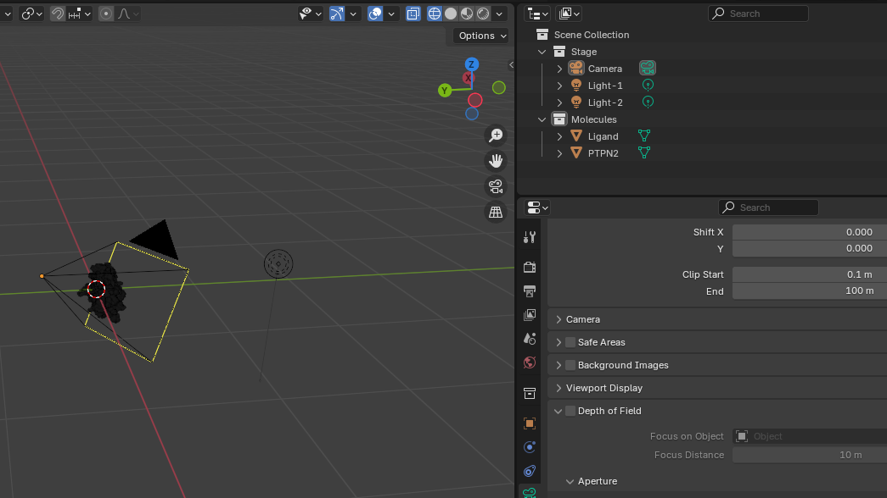
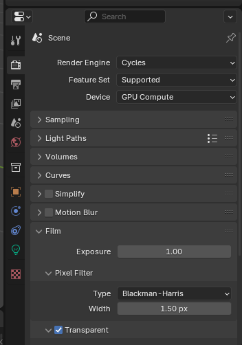
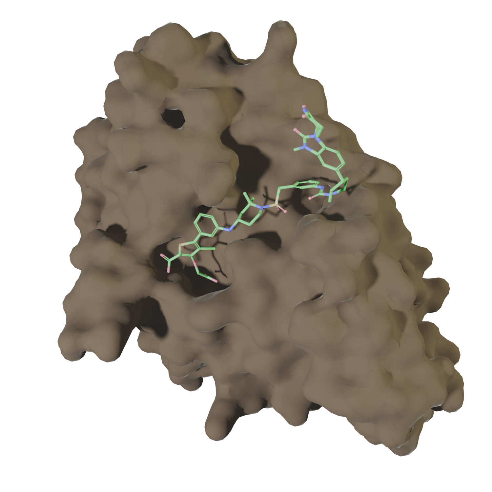
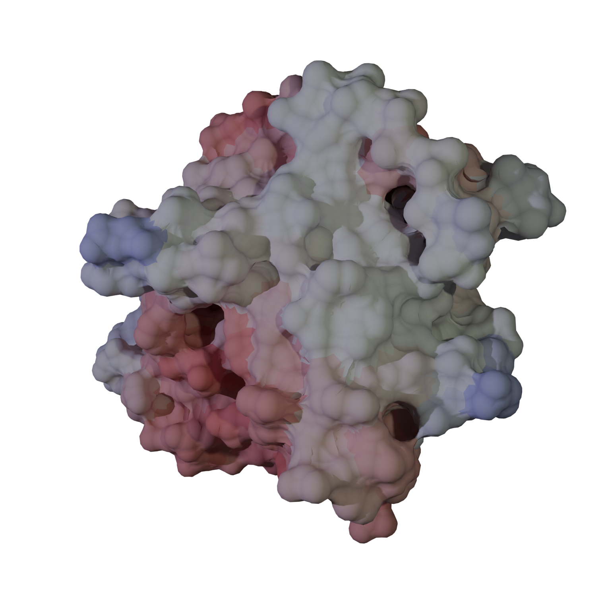

# Import Structures from PDB

## Overview
The aim of this session is to demonstrate the options for loading objects into Blender and making basic initial preparations.

## Objectives
- Load a protein as a surface and a ligand as ball-and-stick using PyMol.
- Perform initial preparation of the objects.

## Input Files
List of any materials or resources needed for this session.

## Steps

### 1. Install Blender Extensions
The VRML2 format provides the highest compatibility between PyMol and Blender. However, since Blender v4.2 no longer supports this format by default, you’ll need an extension. Download it from [this webpage](https://extensions.blender.org/add-ons/web3d-x3d-vrml2-format/).

### 2. Open PDB File in PyMol
Open the `8uh6.cif` file and create the desired representations. In this case, the protein is depicted as a surface, and the ligand as a ball-and-stick model. See [hints](./s1_hints.md).

```
set stick_radius, 0.16
set stick_ball, on
set stick_ball_ratio, 1.1
```


The color of the surface doesn't matter, as it won't be transferred into Blender. It is better to export the objects one by one.

### 3. Export Objects from PyMol
- Make only the ligand visible. Export it by navigating to "File -> Export Image As -> VRML 2" and save it as `pymol/ligand.wrl`.
- Make only the protein visible. Export it and save it as `pymol/protein.wrl`.

### 4. Import the Ligand into Blender
- In Blender, go to "File -> Import -> X3D Extensible 3D" and select the `pymol/ligand.wrl` file.
- The ligand will be imported as multiple objects. It is convenient to join them together. Select all balls and sticks (excluding Viewpoint and DirectLight) and join them (`Ctrl + J` or "Object -> Join").  
  

### 5. Import the Protein Surface
- Import the protein surface in the same way: "File -> Import -> X3D Extensible 3D" and select the `pymol/protein.wrl` file.

### 6. Clean Up the Surface
(**Important step!**) Clean up the surface to remove extra vertices:
- Select the surface.
- Enter *Edit Mode* (press `Tab`).  
  
- Clean up the surface: "Mesh -> Clean Up -> Merge by Distance."
- You should notice some vertices being removed:  

- Return to *Object Mode*.

### 7. Organize Objects and Collections
- Rename the objects and organize them into collections (e.g., "molecules" and "stage").
- Remove any DirectLights and Viewpoints.

### 8. (Optional) Scale Objects
The original size of the imported objects might be too large (e.g., 61.5 x 51.8 x 47.6 meters, the size of a small building). You may want to scale them down to a manageable size:
- Press `N` to open the side panel.
- Select both the protein and ligand.
- Scale down by pressing `S`, typing `0.01`, and hitting `Enter`.
- Center the objects using `Shift + S -> 7 -> .`.
- Apply the scale: `Ctrl + A -> Scale`.

### 9. Add Camera and Lighting
- Add a Camera and Point Light to the "Stage" collection and adjust their positions.



### 10. Final Adjustments for Rendering
- Position the camera (using the "Camera to View" option can help).
- Adjust the lighting and add material to the protein surface.
- For a transparent background, enable "Transparent" in the Render Properties under "Film -> Transparent."
  

## Conclusion
This is a basic workflow that allows the import of molecular structures into Blender.
The final result might looks like this 

## Challenges (Optional)
Challenge 1: Repeat the process using VMD, but add color to the surface.
- Use b-factor for coloring
- Save as Wavefront (OBJ/MTL)


## Additional Resources
- [Usefult set of tutorials](https://www.youtube.com/@blenderguru)
- [Blender plugin](https://github.com/durrantlab/blendmol) that can import VMD "Visualization State" files.