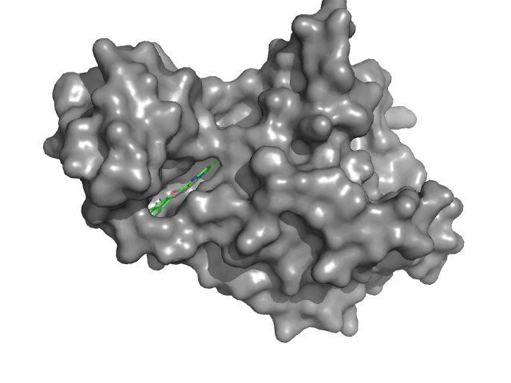
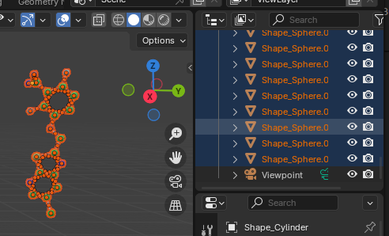
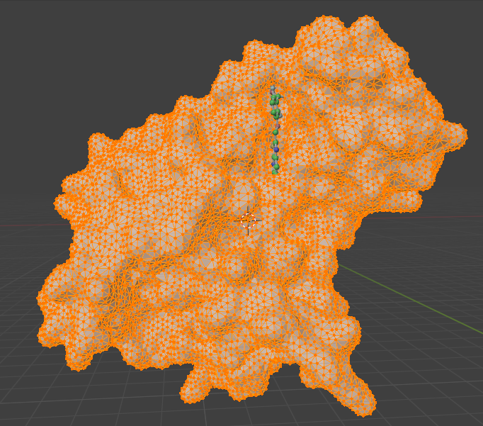
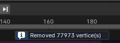
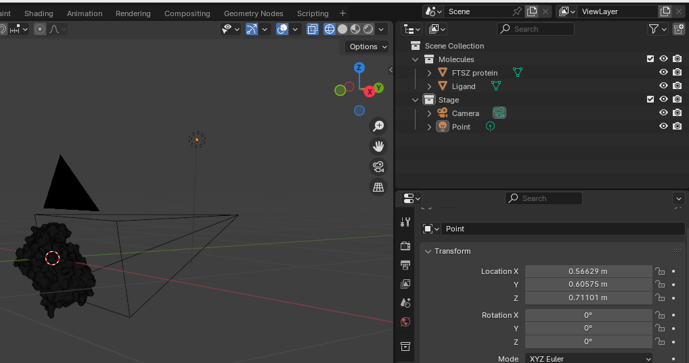

# Import the structures from PDB

## Overview
The aim of that session is to demonstrate the options for loading objects into Blender and make basic initial preparation.

## Objectives
- Load protein as the surface and ligand as ball and sticks using PyMol.
- Do the same using VMD, but add some color to the surface.
- Make an initial preparation of the objects

## Input files
List of any materials or resources needed for this session.

## Steps
1. Step 1: Open `4dxd.pdb` file and make desired representation. In that case the protein is depict as the surface and ligand as ball and stick:
```
preset.ball_and_stick(selection='ligand', mode=1)
```


The color of the surface doesn't matter, it won't be exported. Then we need to export the objects, better to do it one by one.

2. Step 2: export the objects, better to do it one by one.
   - Make visible only the ligand. Export by "File - Export Image As - VRML 2" and save it as `pymol/ligand.wrl`.
   - Make visible only the protein. Export and save it as `pymol/protein.wrl`.
3. Step 3: Open Blender and import ligand in Blender:
   - Import: "File - Import - X3D Extensible 3D" and select the file `pymol/ligand.wrl`.
   - It is imported as many objects, would be convenient to join them together. Select all balls and sticks (not Viewpoint and DirectLight) and join (`Cntr+J` or Object-Join).
   

4. Step 4: Import the surface: "File - Import - X3D Extensible 3D" and select the file `pymol/protein.wrl`.

5. Step 5: (**Important step!**) Clean up the surface and remove vertices.
   - Select the surface
   - Enter to *Edit mode* (press `Tab`)
   
   - Clean up: "Mesh - Clean Up - Merge by Distance".
   - You should notice that some vertices were removed:
   
   - Come back to `Object mode`.

6. Step 6: Rename objects and make to collections ("molecules", "stage"). Remove DirectLights and Viewpoints.

7. Step 7: (optional but nice to do) Scale up everything to a reasonable size. Original size is 3.54 x 4.58 x 14.9 meters, which is size of the small building. Something that might be placed on the desk is more expected to work with.
   - Press `N` to have a side panel
   - Press `A` to select everything
   - Scale-up (`S` - `0.01 Enter`)
   - Center (`Shift + S` - `7` - `.`)
   - Apply (`Ctrl + A` + Scale)

8. Step 8: Add Camera and Point light (to the "Stage" collection). Adjust their locations. 



## Tips
- Tip 1: It is convenient to adjust the camera position in *Camera to View* mode

## Challenges (Optional)
- Challenge 1: It is possible to import from the VMD session (using Wavefront format). In that case, the color of the surface will be preserved.


## Conclusion
This is a basic workflow that allows to import of molecules to Blender.
