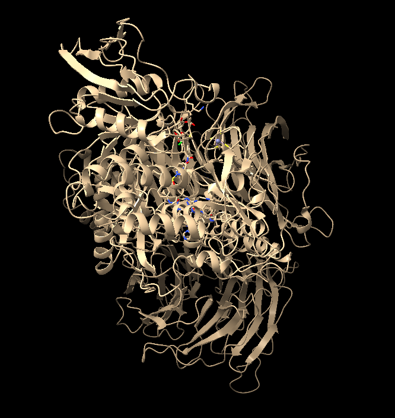
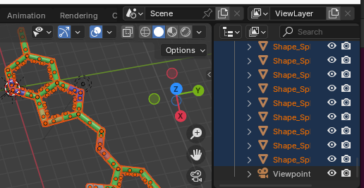
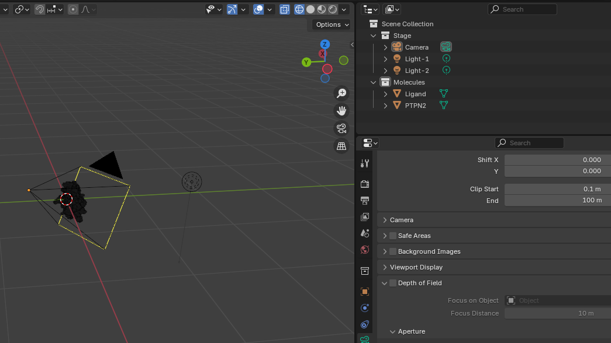
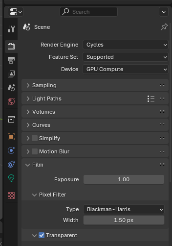
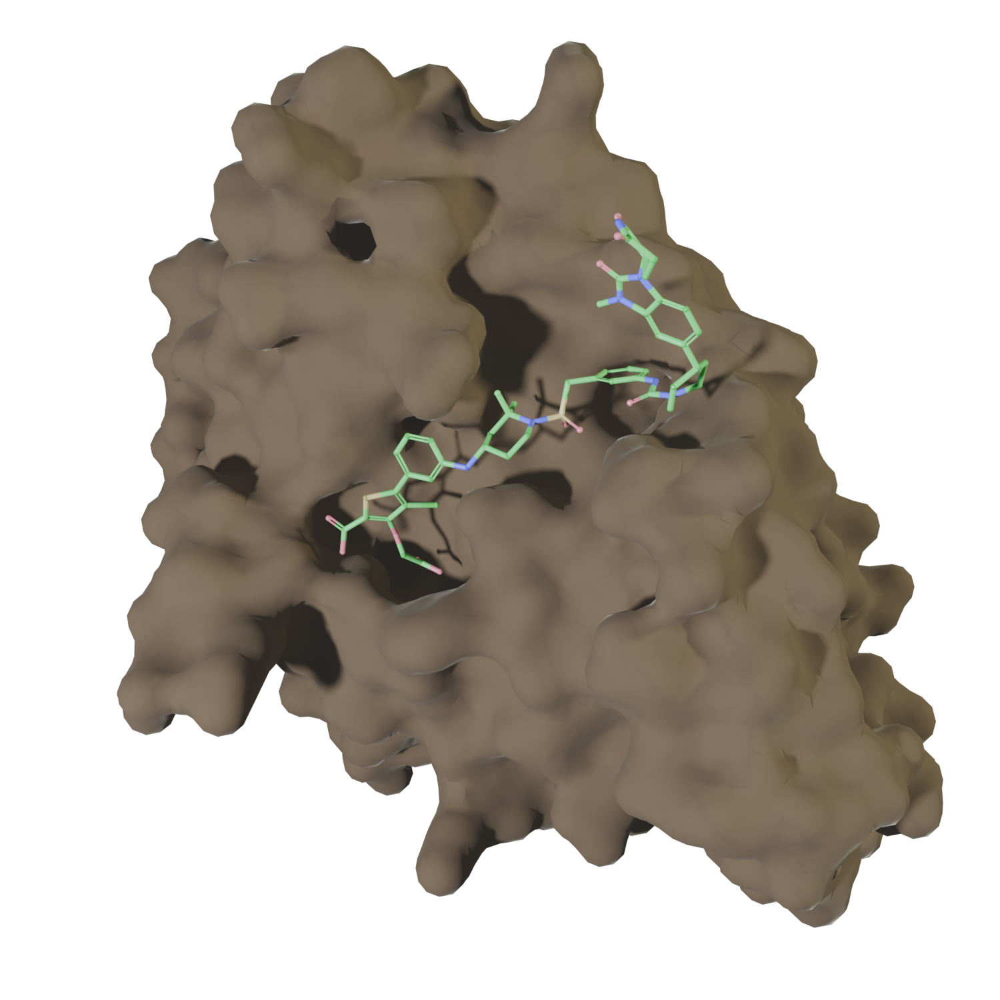
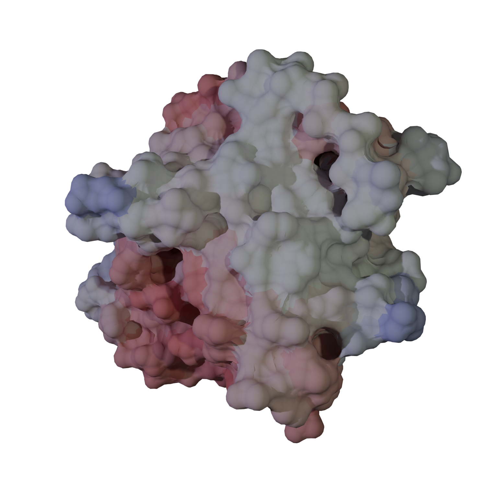

# Import Structures

## Overview
The aim of this session is to demonstrate the options for loading objects into Blender and making basic initial preparations.

## Objectives
- Load a protein as a surface and a ligand as ball-and-stick using ChimeraX.
- Perform initial preparation of the objects.

## Input Files
List of any materials or resources needed for this session.

## Steps

All the commands can be typed in the bottom command bar, as shown in the following steps.

### 1. Open PDB File in ChimeraX
In order to get the 8uh6 protein structure it is possible to fetch it by ID, using the command:
```
open 8uh6 fromDatabase pdb format mmcif
```


### 2. Export Objects from PyMol

To save the file in the right place it is necessary to navigate into the proper folder:
```
cd path/to/folder
```

Once placed in the appropriate folder, to save the ligand, it is necessary to select it at first using the command:
```
select
hide 
select :WO8
show sel target ab
```
The name of the ligand (WO8) can be found by investigating the file's metadata:
```
log metadata #1
```

To explort the file it is possible to use the following command (the name can be changed accordingly):
```
save 8uh6.glb
```

Since the default visualization (as seen above) is the cartoon one, the export will save the cartonn structure. To change this and add also atoms and surface it is possible to use the followinf commands before saving:
- to save also surfaces:
```
show surfaces
```
- to save also atoms:
```
show atoms
```

For this session the file was saved in 

### 3. Import the Ligand into Blender
- In Blender, go to "File -> Import ->.glTF 2.0 (.glb/.gltf)" and select the `pymol/ligand.wrl` file.
- The ligand will be imported as multiple objects. It is convenient to join them together. Select all balls and sticks (excluding Viewpoint and DirectLight) and join them (`Ctrl + J` or "Object -> Join").  
  

### 4. Import the Protein Surface
- Import the protein surface in the same way: "File -> Import -> X3D Extensible 3D" and select the `pymol/protein.wrl` file.

### 5. Clean Up the Surface
(**Important step!**) Clean up the surface to remove extra vertices:
- Select the surface.
- Enter *Edit Mode* (press `Tab`).  
  
- Clean up the surface: "Mesh -> Clean Up -> Merge by Distance."
- You should notice some vertices being removed:  

- Return to *Object Mode*.

### 6. Organize Objects and Collections
- Rename the objects and organize them into collections (e.g., "molecules" and "stage").
- Remove any DirectLights and Viewpoints.

### 7. (Optional) Scale Objects
The original size of the imported objects might be too large (e.g., 61.5 x 51.8 x 47.6 meters, the size of a small building). You may want to scale them down to a manageable size:
- Press `N` to open the side panel.
- Select both the protein and ligand.
- Scale down by pressing `S`, typing `0.01`, and hitting `Enter`.
- Center the objects using `Shift + S -> 7 -> .`.
- Apply the scale: `Ctrl + A -> Scale`.

### 8. Add Camera and Lighting
- Add a Camera and Point Light to the "Stage" collection and adjust their positions.



### 9. Final Adjustments for Rendering
- Position the camera (using the "Camera to View" option can help).
- Adjust the lighting and add material to the protein surface.
- For a transparent background, enable "Transparent" in the Render Properties under "Film -> Transparent."
  

## Conclusion
This is a basic workflow that allows the import of molecular structures into Blender.
The final result might looks like this 

## Challenges (Optional)
Challenge 1: Repeat the process using VMD, but add color to the surface.
- Use b-factor for coloring
- Save as Wavefront (OBJ/MTL)


## Additional Resources
- [Usefult set of tutorials](https://www.youtube.com/@blenderguru)
- [Blender plugin](https://github.com/durrantlab/blendmol) that can import VMD "Visualization State" files.