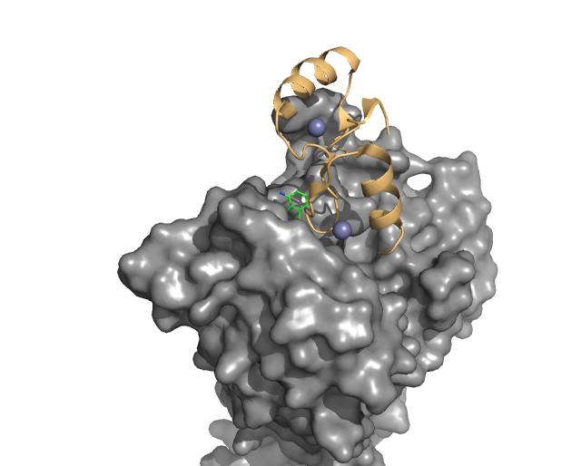
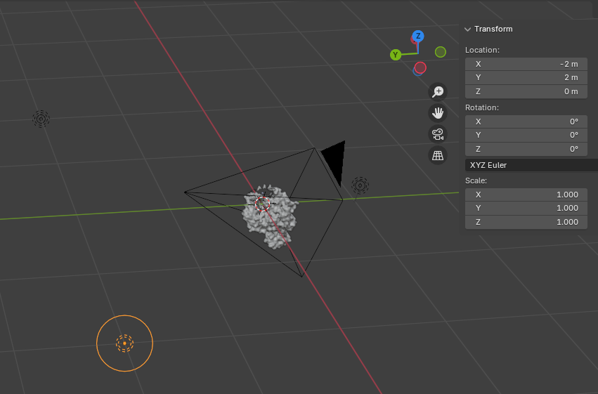
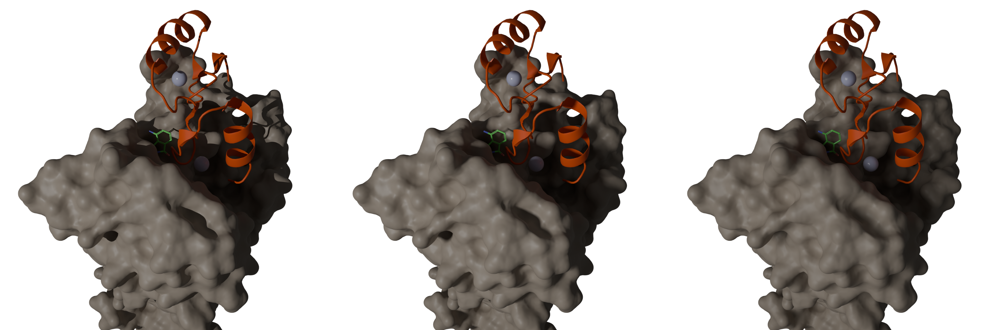
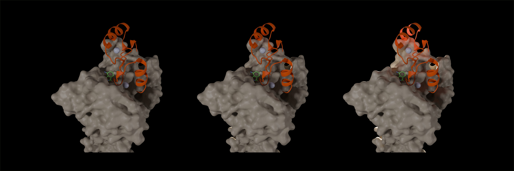
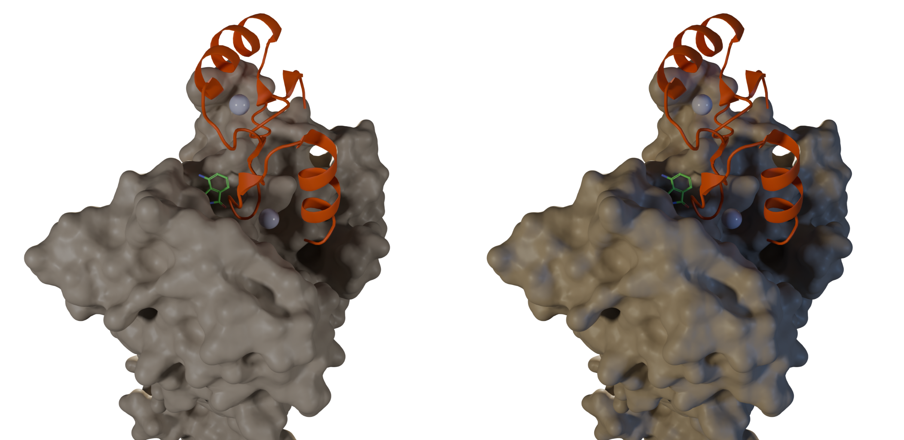
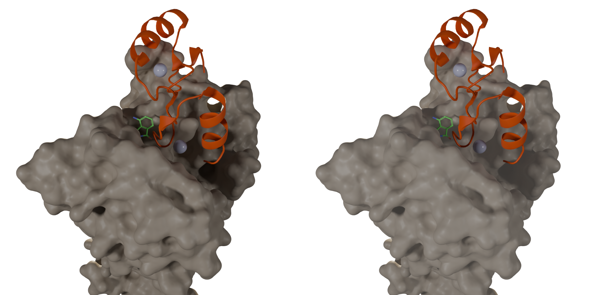
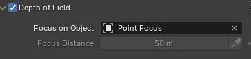
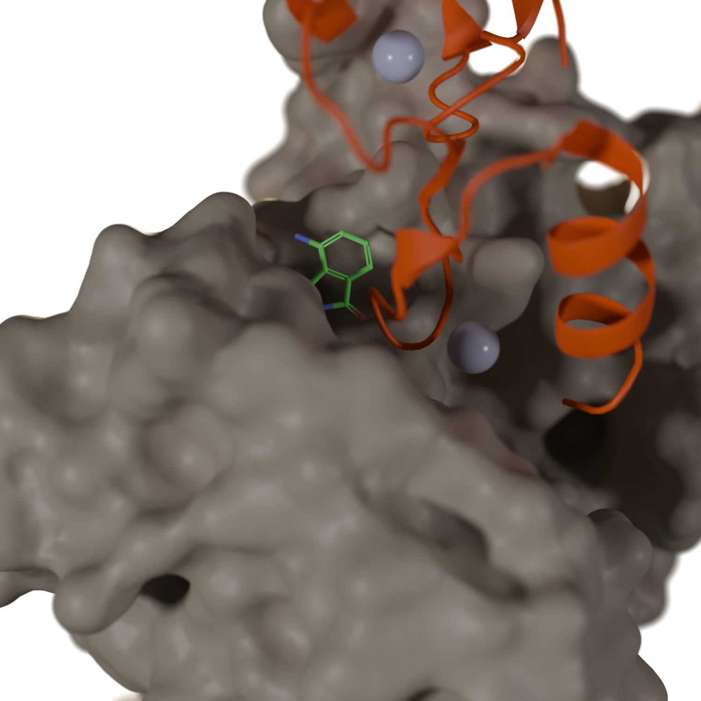

# **Lighting and Filming**

## **Overview**
This section focuses on enhancing the visual appeal and scientific clarity of protein and small molecule models using Blender's lighting system.

---

## **Objectives**
- Setting up basic lighting and filming.

---

## Materials & software
- **Protein Data Bank ID (PDBID):** `8U16`
- **Used software:**
  - PyMol 3.0.0
  - Blender 4.2

---

## **Examples**

Load the protein, then set the **CRBN protein** as a surface, the ligand as a ball-and-stick model, and display the **SALL4 protein** and Zn ion as spheres.

For better geometry handling, use the "Merge by Distance" option to clean up vertices for each object.

Save your work as `s2.blend` for use in future examples.

---

### **Lighting**

BlenderGuru offers an excellent tutorial on Blender lighting, which you can find [here](https://www.youtube.com/watch?v=Ys4793edotw&list=PLjEaoINr3zgH9vCr47kSS5W8PEJBNIiwK). In this tutorial, we will use the classical three-point lighting scheme:

**Key Light (Main Light)**
- The key light is the primary and brightest light source.
- It’s typically placed at a 45-degree angle from the subject, either to the left or right.
- Its purpose is to define form, cast shadows, and create depth.

**Fill Light**
- The fill light is positioned on the opposite side of the key light, also at a 45-degree angle, but at a lower intensity.
- It softens the shadows created by the key light, balancing the illumination and reducing harsh contrasts.

**Back Light (Rim Light or Hair Light)**
- Positioned behind and slightly above the subject, the back light helps to separate the subject from the background, giving the scene a more three-dimensional appearance.

You can visualize this setup in the following image:

---

### **Tips for Lighting**
- **Tip 1**: Use the Transform panel to adjust the light sources' positions accurately. For example, for a 45-degree angle, you might position the light at (x, y, z) = (-2, 2, 0), as shown in the picture.
- **Tip 2**: The default size of a light source in Blender is 0, which results in extremely sharp shadows. Increase the size for softer shadows.
- **Tip 3**: Objects can emit light, which can help eliminate unwanted shadows if necessary.

---

### **Lighting Demonstrations**

Below are demonstrations showing how different lighting parameters affect the scene. Experiment with parameters like light position, color, power, and type to better understand their effects.

1. **Light Source Size**:
   - Size = 0m (left), 0.2m (center), 1m (right)
   

2. **Back Light Intensity**:
   - 0% (left), 50% (center), 500% (right)
   

3. **Lighting Colors**:
   - All white (left), yellow and blue (right)
   

4. **Object Emission**:
   - No emission (left), emission = 0.03 (right)
   

---

### **Camera Setup**

The camera in Blender mimics real-world cameras. You can adjust the focal length and focus on objects to create the desired effect. For precise control, it’s useful to add an empty object (Add -> Empty -> Plain Axes) to serve as a focus target.

You can highlight specific objects by adjusting the camera’s focus to emphasize them in the scene:

