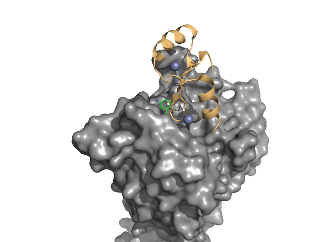

# Enhancing Visualization with Materials, Lighting, and Shaders

## Overview
Focus on how to make protein and small molecules more visually appealing and scientifically informative by using material and lighting system.

## Objectives
- Setting Up Basic Lighting, Filming
- Applying Materials to Different Parts of the Model
- Introduction to Shaders
- Environment Maps for Reflection and Lighting

## Materials
- PDBID `8U16`

## Examples

Load protein, select CRBN protein as a surface, ligand as ball and stick, SALL4 protein and Zn ion (as spheres).

A good practice is clean up vertices (merge by distance) for each objects.

Save it as `s2_general.blend` for using in the further examples.

### Light and Camera 
1. Step 1: [Description of the step]
2. Step 2: [Description of the step]
3. Step 3: [Description of the step]
   - Sub-step or additional details if needed
4. Step 4: [Description of the step]

### Light and Camera 

## Tips
- Tip 1: [Helpful tip or advice]
- Tip 2: [Helpful tip or advice]

## Challenges (Optional)
- Challenge 1: [Description of the challenge]
- Challenge 2: [Description of the challenge]

## Additional Resources
- [Link to additional resource 1]
- [Link to additional resource 2]

## Conclusion
Brief summary of what was covered in this session and any key takeaways.
