# Materials

## Overview
This session aims to familiarize you with Blender's material system and its applications in rendering proteins and molecules.

## Objectives
* Basic material adjustments.
* Node-based workflows.
* Physically Based Rendering (PBR) for realistic materials.

## Materials & software
- **Protein Data Bank ID (PDBID):** `8RQ8`
- **Used software:**
  - PyMol 3.0.0
  - Blender 4.3.0 (ensure the Node Wrangler addon is enabled)

## Steps

### 1. Prepare PyMol scene 

Open the structure `6H0G` from the [PDB database](https://www.rcsb.org/structure/6H0G) and create the desired representations. For this tutorial:
- **CRBN protein (chain E):** Surface representation
- **Zn ions:** Spheres
- **Ligand:** Ball-and-stick representation with these settings:
  ```pymol
  set stick_radius, 0.3
  set valence, off
  set stick_ball, on
  set stick_ball_ratio, 1.8
  ```
- **ZNF692 (chain F):** Represented as both surface and lines (copied).

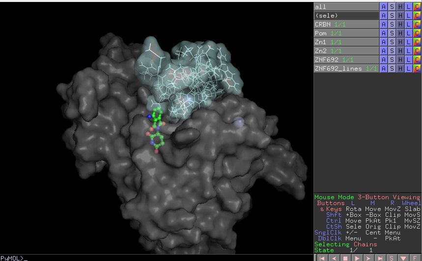

### 2. Export Objects from PyMol

Export the objects as follows:
- CRBN surface → `pymol/surface_1.wrl`
- ZNF692 surface → `pymol/surface_2.wrl`
- ZNF692 lines → `pymol/lines.wrl`
- Zn ions → `pymol/Zns.wrl`
- Ligand → `pymol/ligand.wrl`

In Blender, import the `.wrl` files as outlined in [Session 1](../session_1/s1.md). Key actions:
- Clean up protein surfaces in edit mode.
- Combine stick/line objects into one (ligand and ZNF692 lines)
- Delete imported **Direct Light** and **Viewpoint** objects.


Scale down (factor `0.005`) to set the CRBN protein size to ~30 cm. Center the scene (`Shift+S`, `7`, `.`), adjust the camera, and add lights as per [Session 2](../session_2/s2.md). Use a square resolution (1500x1500 px) for an Instagram-friendly render :)

The initial scene looks like this:
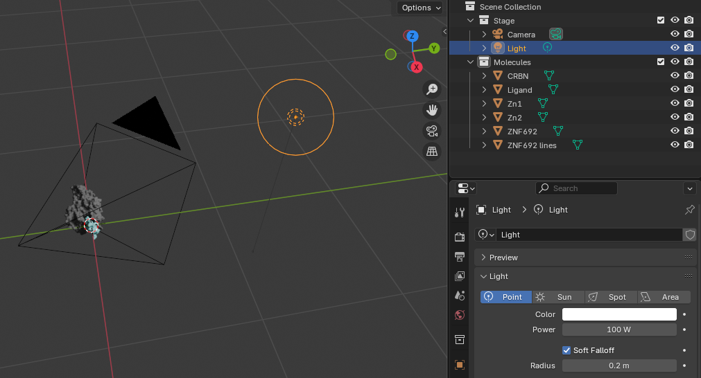

### 3. Basic material setup

The fastest way to adjust materials is modifying **Principled BSDF** properties. For example, make Zn ions metallic:
1. Select a Zn sphere.
2. Rename its material to "Zn."
3. Set properties to achieve a metallic look:
   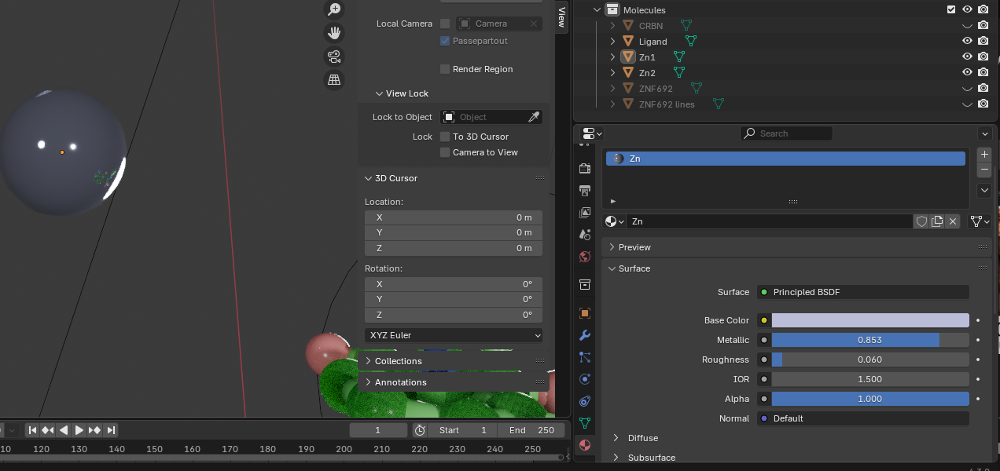

4. Apply the "Zn" material to other Zn spheres.

Usually, simply adjusting the **Base Color**, **Metallic**, and **Roughness** parameters is sufficient to achieve the desired result. 

### 4. Removing PyMol's materials

PyMol often assigns multiple colors to complex objects, like sticks, balls, or lines. This is useful in some cases, such as small molecules colored by atom types, where the original coloring saves time and ensures accuracy.  
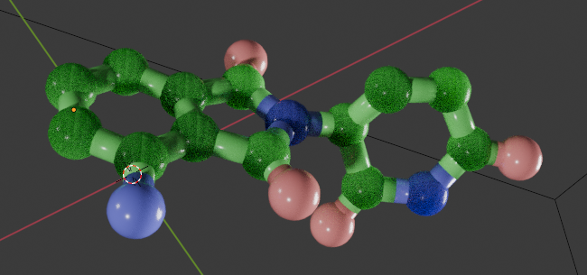

However, for objects that require uniform coloring or simpler scenes, you may want to remove these extra materials. This also reduces file size and scene complexity. For example, the **ZNF692 lines** object is meant to be a single color but contains hundreds of materials:  
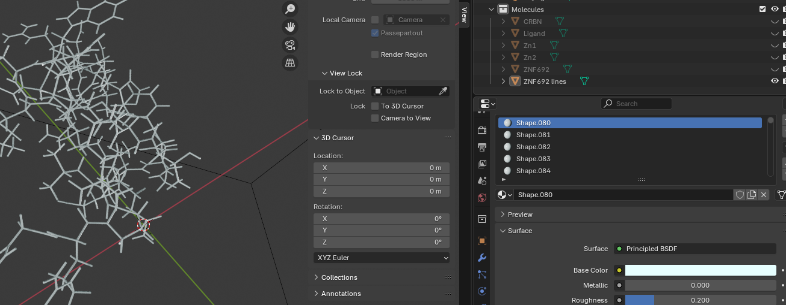

To simplify:
1. Enter edit mode.
2. Assign a single material to the object.
3. Remove unused materials.  

Once simplified, you can customize the material—for instance, making the lines shiny with an emission color (`#CFFF04`, strength `1.2`).  
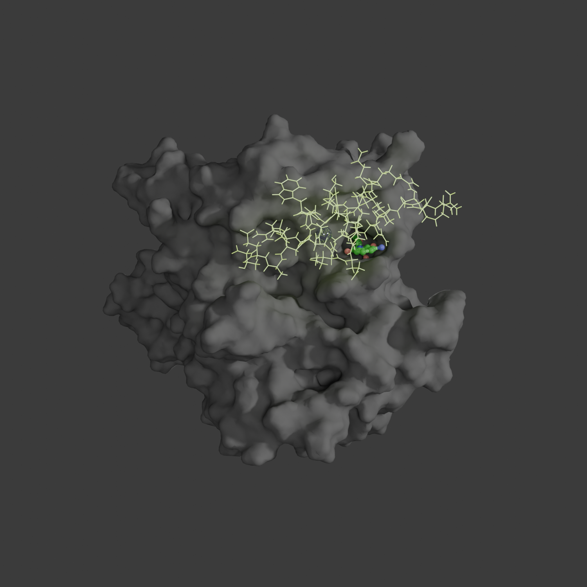  

### 5. Subsurface

Subsurface scattering adds an organic feel, ideal for proteins. Be cautious: it significantly increases rendering time in Cycles. 

Here are example parameters:
- **Color (RGB):** 0.623, 0.433, 0.343
- **Roughness:** 0.95
- **Subsurface Weight:** 0.75
- **Radius (RGB):** 0.482, 0.169, 0.109
- **Scale:** 0.1m

The result (used EEVEE engine to speed up the rendering) without subsurface (left) and with (right):
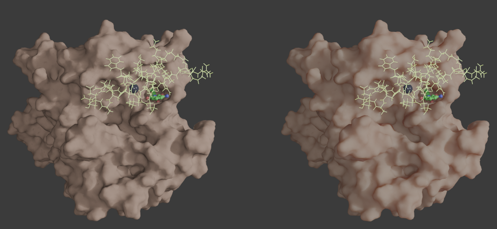

### 6. Nodes

Nodes provide advanced control for materials. Key use cases include:
- Gradient coloring.
- Highlighting active sites.
- Bump mapping.
- Transparency.
- Advanced light interaction.

There are a few examples of using the nodes below. 

#### 6.1 Nodes for transparency

For ZNF692's surface:
1. Remove its material.
2. Create a pale pink material (`#FADADD`).
3. Use this node setup:
   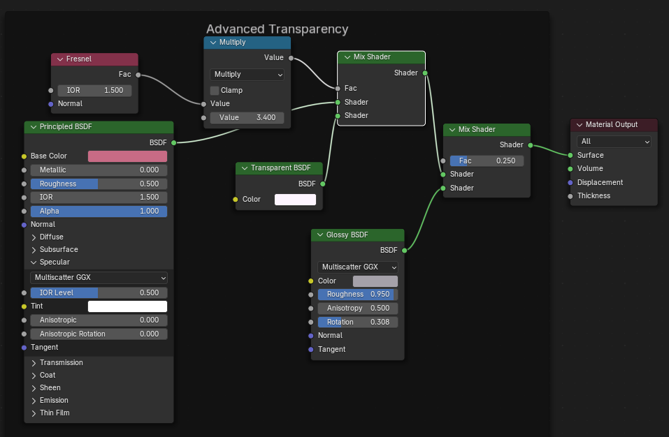

This mixes transparency and the base material with Fresnel for natural effects. A second mix adds glossiness.

Here is side-by-side comparison alpha transparency (left) and node-based (right).
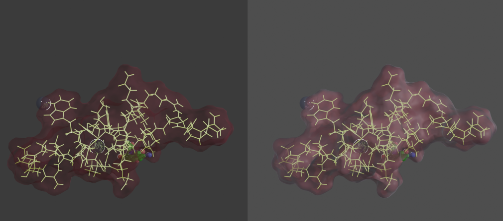

#### 6.2 Nodes for distance-based gradient

Here, I wanted to highlight the surface of the CRBN protein using a gradient, with stronger intensity closer to the ligand.

Add a second camera to view the protein-protein complex differently. Using community solutions (from [here](https://blenderartists.org/t/is-there-a-distance-based-texture-for-blender/1186832/7)), create gradient coloring based on distance from the ligand. Example:
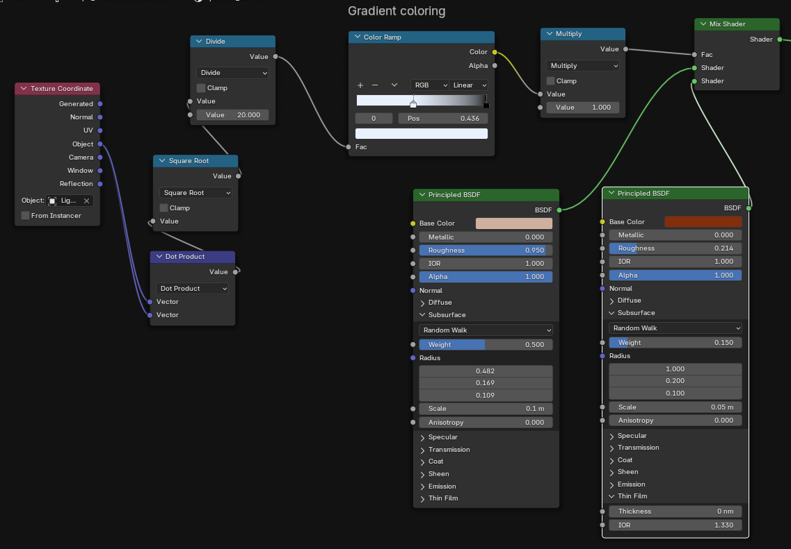


The result for the whole scene:
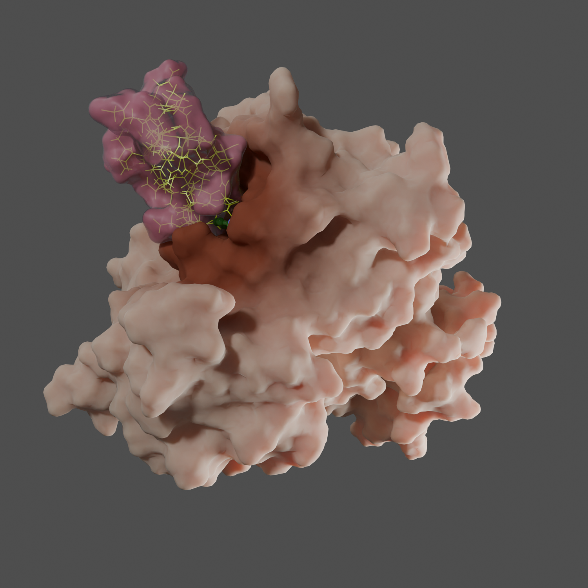

#### 6.3 Bumps

To add texture, connect **Noise Texture** and **Bump** nodes to the BSDF's **Normal** input:
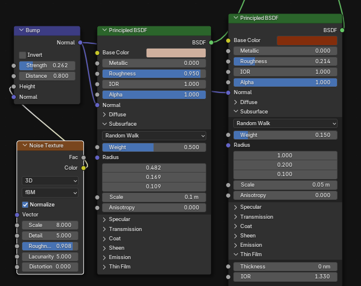

In the results, the surface is not absolutely smooth:
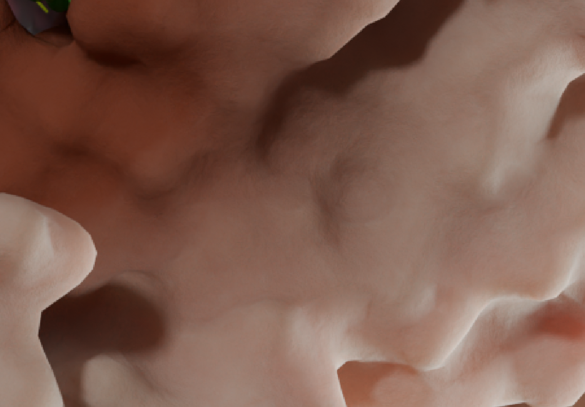


### 7. Physically Based Rendering (PBR)

For realistic surfaces, PBR is invaluable. For example, let's create a carbon fiber table.

1. Add and curl a plane.
2. Download a PBR material (e.g., [carbon fiber](https://freepbr.com/product/carbon-fiber-pbr/)).
3. Add a material to the floor and open the **Node Editor**.  
4. Ensure the **Node Wrangler** addon is enabled, then select the **Principled BSDF** node and press `Ctrl-Shift-T`.  
5. Select the PBR texture files you want to use. Typically, a PBR material set includes:  
   - **Base Color / Albedo** (`*_diffuse` or `*_albedo`)  
   - **Roughness** (`*_roughness`)  
   - **Metallic** (`*_metallic`)  
   - **Normal Map** (`*_normal`)  
   - **Ambient Occlusion (AO)** (`*_ao`)  
   - **Height / Displacement** (`*_height`) *(optional, improves realism but resource-intensive)*  

   **Tip:** I usually avoid `*_height` textures unless displacement is specifically needed, as they require more resources.  
6. Add a new camera, adjust its location, enable **Depth of Field** (focus on the ligand), and switch the scene to this new camera.  

The final results:

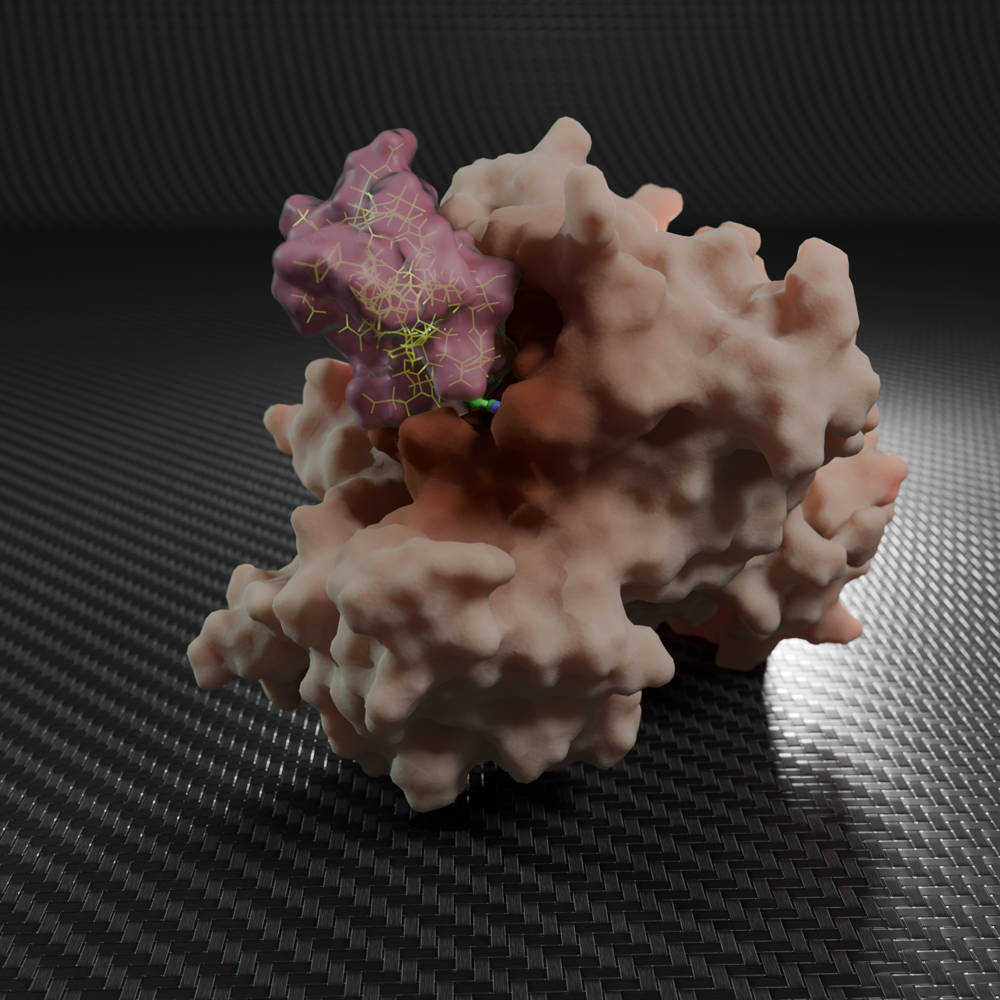

## Conclusion
This session covered basic and advanced material techniques, demonstrating Blender’s flexibility for rendering of the proteins and molecules.

## Additional Resources
- [How to remove materials in Blender](https://www.youtube.com/watch?v=AyTqdzpUakk)  
- [Material presets for Subsurface Scattering](https://blender.stackexchange.com/questions/179560/how-to-use-subsurface-scattering-in-principled-bsdf)  
- [Free PBR materials](https://freepbr.com/)  
- [High-quality PBR materials](https://www.poliigon.com/)